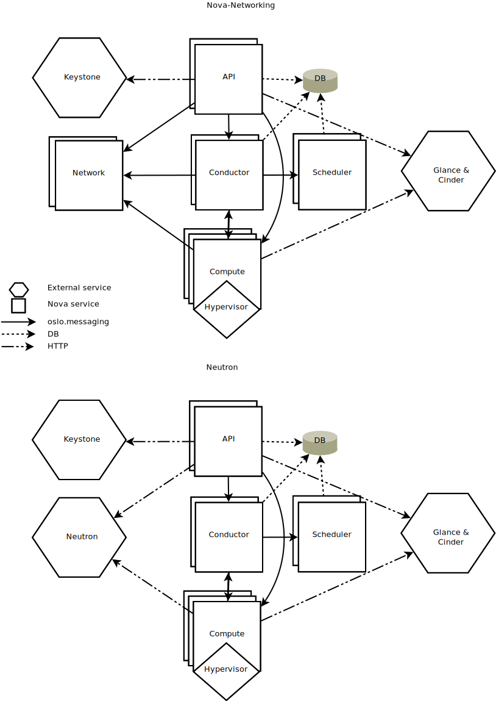
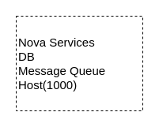
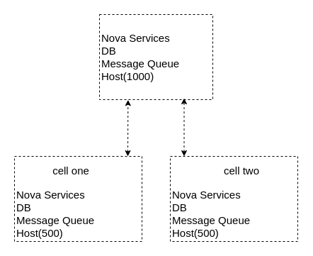
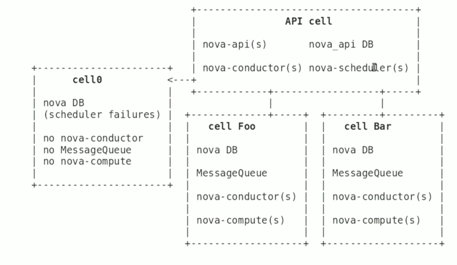
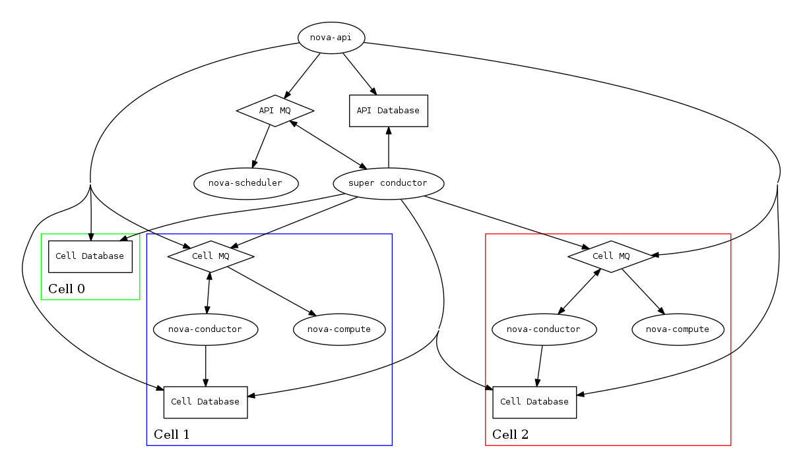
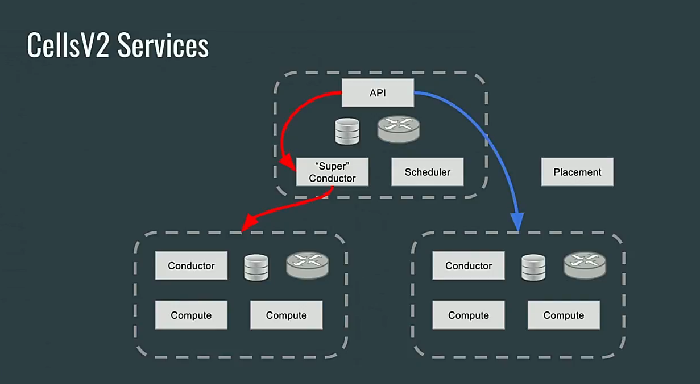

# Nova Introduction

## Introduction

Nova is the OpenStack project that provides a way to provision compute instances (aka virtual servers). Nova supports creating virtual machines, baremetal servers (through the use of ironic), and has limited support for system containers. Nova runs as a set of daemons on top of existing Linux servers to provide that service.

List of main services in Nova Project used to provide compute instance:

- nova-api: Compute service endpoint interface, listen HTTP request, convert command.
- relational database: Store information about instances in system.
- nova-scheduler: Decide which host get each instance
- nova-compute: Manages communication with hypervisor and virtual machines.
- nova-conductor: Offload for nova-api in long-running tasks (create/resize instance), act as database accessing proxy for compute, or handles object conversions.
- messaging queue: Provide inter-process communication method
- placement-api: Track resource provider inventories and usages, along with different classes of resources. A separated HTTP API service with nova-api.
- nova console-auth:...

## Architect

### Old Architect

Before Ocata version, most of nova deployment use old architect as figure below:

The problem with this architect is: There is only one database component served for whole system. With one DB component like this, we cannot horizon scale system when number of service/instance is large enough, because in practice, write perfomance of a Database service will not increase when we horizon scale it. And if we have only one DB component, then when this DB component is corrupt, all of system will stop working. Like this, messaging queue service also have scaling problem as DB service.

Because these problems, we need use new architect for nova project, and it call Cell v2.

### Current Architect (Cell v2)

The Cell v2 Architect is solution for scaling problem in Nova. This architect separate nova services in a deployment to small pieces called **cells**. Example [1]:

- In old architect, without cell we must store all information of a thoudsand hosts in nova project in one "big database". Also communication with those thoudsand hosts also use only a message queue.

In new architect, these sevices can be separated into three cells: one API cell, called "parent cell" and two cell, each cell manage 500 hosts, "called children cell".  Each cell has it own database and message queue, so that each database and message queue in children  cell will only store information and communicate for 500 host.

With this architect, the "big database" can break to a smaller database, thus improve database scalability. Similiarly, the message queue also separate to smaller message queue.

Cell architect is method to grouping hosts to groups call "cell". Each cell has it own database and message queue, and have same set of nova services which manage hosts live in it. Cell Architect define two cell type as i mentioned above: parent cell, which contain API service and children cell, with contain hosts. A deployment can has many children cells, but is always has only one parent cell.

With cell architect, parent cell is the cell which receives request, then when parent cell handle requests, it can send requests to child cells to handle job.

The detail component of parent cell and child cell are described by below diagram [2]:

A basic Nova system consists of the following components [4]:

* The nova-api service which provides the external REST API to users.
* The nova-scheduler and placement services which are responsible for tracking resources and deciding which compute node instances should be on.
* An “API database” that is used primarily by nova-api and nova-scheduler (called API-level services below) to track location information about instances, as well as a temporary location for instances being built but not yet scheduled.
* The nova-conductor service which offloads long-running tasks for the API-level service, as well as insulates compute nodes from direct database access
* The nova-compute service which manages the virt driver and hypervisor host.
* A “cell database” which is used by API, conductor and compute services, and which houses the majority of the information about instances.
* A “cell0 database” which is just like the cell database, but contains only instances that failed to be scheduled.
* A message queue which allows the services to communicate with each other via RPC.

In this point, you may have some questions like this:

- How does api cell interact with host cell ?
- How to setup nova with Cell v2 ?
- Which informations are stored in api cell, and which information are stored in host cells ?

## Information store in each cell in cell v2

- Api cell database - nova api database store global data such as flavors, keypairs, host aggregate information, mapping to cells, instances, computes
    - This mean api cell database store list of cells, which cell a host is in, which host and cell a instance is in...
- Children cell store the rest information of an instance.

With this database schema, we has these benefits:

- Global data (api database) has little database enough for us to easily use some techniques as duplicating, synchronizing, clustering,...
- No has duplicated data between api database and cell database, thus no have synchornizing required between api database and cell database.

## The way how a job is handled in nova cell v2 architect

In cell v2, we has two main ways to handle a job which is received by nova-api:

- With heavy-load jobs as booting, resizing a instance,... Nova-api will use nova-conductor service in api cell (callled super conductor) to offload these jobs. Super conductor will determine which instance in which cell affected by this job, then it will communicate with conductor service of that cell to send request over rpc to that conductore service. Cell conductor service will interact with cell database and compute service of host that is hosting affected instance to handle the rest of job.
- With light-load job as restart, poweroff a instance,... Nova-api will send request directly to compute service manage affected instance to handle job, because it know location of this instance (which cell this instance is in) by access api database.

## Scheduling in cell v2 architect

To implement scheduling action, nova cell v2 use a global scheduler service for whole deployment instead two level scheduling as cell v1 to avoid duplicate scheduling in cell v1, which can lead to incorrect scheduling decision when a cell has not enough resources to host two instance which are scheduled to this cell at the same time. Global scheduler service in cell v2 has all information about hosts in deployment, then it can determine which host, not which cell will host a new instance created.

#### Different between Cell v1 and Cell v2

See [2]

## Some caveats of nova cell v2 

Although has many advantage over flat architect and also cell v1, but cell v2 still has some disavantages [4]:

- Cross-cell instance migrations
- Quota-related quirks
- Performance of listing instances
- Notifications
- Neutron Metadata API proxy
- Operations Requiring upcalls

### Noticed problem: Attaching a volume and [cinder]/cross\_az\_attach=False

This is a problem because when a volume is attached to an instance in the nova-compute service, and [cinder]/cross_az_attach=False in nova.conf, we attempt to look up the availability zone that the instance is in which includes getting any host aggregates that the instance.host is in. Since the aggregates are in the API database and the cell conductor cannot access that information, so this will fail. In the future this check could be moved to the nova-api service such that the availability zone between the instance and the volume is checked before we reach the cell, except in the case of boot from volume where the nova-compute service itself creates the volume and must tell Cinder in which availability zone to create the volume. Long-term, volume creation during boot from volume should be moved to the top-level superconductor which would eliminate this AZ up-call check problem.

## References

- [1][https://www.openstack.org/videos/austin-2016/nova-cells-v2-whats-going-on](https://www.openstack.org/videos/austin-2016/nova-cells-v2-whats-going-on)
- [2][https://www.openstack.org/videos/boston-2017/scaling-nova-how-cellsv2-affects-your-deployment](https://www.openstack.org/videos/boston-2017/scaling-nova-how-cellsv2-affects-your-deployment)
- [3][https://docs.openstack.org/nova/latest/user/cells.html](https://docs.openstack.org/nova/latest/user/cells.html)
- [4][https://docs.openstack.org/nova/latest/user/cellsv2-layout.html](https://docs.openstack.org/nova/latest/user/cellsv2-layout.html)
